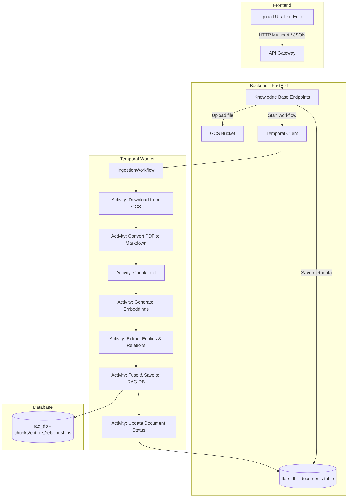

# Knowledge Base Management — Backend Plan

## 1. Tổng Quan

Xây dựng hệ thống quản lý Knowledge Base cho FLAE Agents, cho phép admin/owner của workspace upload tài liệu (PDF, Markdown, Text) hoặc nhập text trực tiếp, sau đó chạy pipeline TGS-RAG (Text-Graph Synergy) qua Temporal workflows để ingestion vào `rag_db`.

### Phạm vi
- **Database:** Metadata tài liệu lưu trong `flae_db`, dữ liệu RAG (chunks/entities/relationships) lưu trong `rag_db`
- **File Storage:** Google Cloud Storage (GCS)
- **Background Processing:** Temporal workflows cho ingestion pipeline
- **Phân quyền:** Workspace-level (tất cả member xem được, chỉ admin/owner upload/xóa)
- **LLM/Embedding Provider:** Google Gemini (text-embedding-004 + gemini-flash)

---

## 2. User Review Required

> [!IMPORTANT]
> **GCS Credentials:** Cần cấu hình GCS bucket name và service account cho backend. Biến môi trường `GCS_BUCKET_NAME` sẽ được thêm vào config.

> [!WARNING]
> **Chi phí API:** Full TGS-RAG pipeline sẽ gọi Gemini API cho cả Embedding lẫn Entity Extraction. Mỗi tài liệu lớn có thể tốn hàng nghìn tokens. Cần có cơ chế rate limiting và retry.

> [!IMPORTANT]
> **Dependencies mới:** Cần thêm `google-cloud-storage`, `google-genai`, `tiktoken`, `docling` (cho PDF→Markdown) vào `pyproject.toml`.

---

## 3. Open Questions

> [!IMPORTANT]
> **Giới hạn file size:** Nên giới hạn kích thước file upload tối đa là bao nhiêu? (Đề xuất: 50MB cho PDF, 10MB cho text/markdown)

> [!IMPORTANT]
> **Docling dependency:** Thư viện `docling` (PDF→Markdown converter dùng trong demo-app) khá nặng và có nhiều dependencies phụ thuộc (PyTorch, etc). Có 2 lựa chọn:
> 1. Cài `docling` trực tiếp trong backend worker → nặng nhưng accurate
> 2. Dùng thư viện nhẹ hơn như `pymupdf4llm` hoặc `pdfplumber` → nhẹ nhưng có thể kém chính xác hơn
> Cần quyết định trước khi implement.

---

## 4. Kiến Trúc Tổng Quan



---

## 5. Proposed Changes

### 5.1. Database Schema (flae_db)

#### [NEW] `backend/app/models/knowledge_base.py`

Tạo SQLAlchemy models cho metadata quản lý tài liệu trong `flae_db`:

```python
class DocumentStatus(str, Enum):
    pending = "pending"          # Vừa upload, chưa xử lý
    processing = "processing"    # Đang chạy ingestion pipeline
    completed = "completed"      # Ingestion thành công
    failed = "failed"            # Ingestion lỗi
    
class DocumentType(str, Enum):
    pdf = "pdf"
    markdown = "markdown"
    text = "text"
    manual_input = "manual_input"  # Nhập text trực tiếp

class KnowledgeDocument(BaseModel):
    __tablename__ = "knowledge_documents"
    
    workspace_id: Mapped[uuid.UUID]  # FK -> workspaces.id
    title: Mapped[str]               # Tên tài liệu
    description: Mapped[Optional[str]]
    document_type: Mapped[DocumentType]
    
    # File info (null nếu manual_input)
    file_name: Mapped[Optional[str]]
    file_size: Mapped[Optional[int]]       # bytes
    gcs_path: Mapped[Optional[str]]        # gs://bucket/path
    mime_type: Mapped[Optional[str]]
    
    # Manual input content (null nếu file upload)
    content_text: Mapped[Optional[str]]    # Text/Markdown content trực tiếp
    
    # Ingestion status
    status: Mapped[DocumentStatus]
    error_message: Mapped[Optional[str]]   # Lỗi nếu failed
    temporal_workflow_id: Mapped[Optional[str]]
    
    # Ingestion metrics
    chunk_count: Mapped[Optional[int]]
    entity_count: Mapped[Optional[int]]
    relation_count: Mapped[Optional[int]]
    token_usage: Mapped[Optional[dict]]    # JSONB - chi tiết token consumed
    processing_time_seconds: Mapped[Optional[float]]
    
    # Owner info
    uploaded_by: Mapped[str]       # Firebase UID
```

#### [NEW] Alembic Migration

```bash
uv run alembic revision --autogenerate -m "add_knowledge_documents_table"
```

---

### 5.2. Pydantic Schemas

#### [NEW] `backend/app/schemas/sche_knowledge_base.py`

```python
# Request schemas
class DocumentUploadResponse(BaseModel):
    id: uuid.UUID
    title: str
    status: DocumentStatus
    temporal_workflow_id: Optional[str]

class ManualDocumentCreate(BaseModel):
    title: str
    description: Optional[str]
    content_text: str  # Markdown text

class DocumentListItem(BaseModel):
    id: uuid.UUID
    title: str
    description: Optional[str]
    document_type: DocumentType
    status: DocumentStatus
    file_name: Optional[str]
    file_size: Optional[int]
    chunk_count: Optional[int]
    entity_count: Optional[int]
    uploaded_by: str
    created_at: datetime
    updated_at: datetime

class DocumentDetail(DocumentListItem):
    content_text: Optional[str]
    error_message: Optional[str]
    token_usage: Optional[dict]
    processing_time_seconds: Optional[float]
    temporal_workflow_id: Optional[str]

class IngestionConfig(BaseModel):
    """Cấu hình pipeline ingestion - có thể override per-document"""
    chunking_strategy: str = "semantic"  # "fixed" | "semantic"
    chunk_size: int = 1200
    chunk_overlap: int = 100
    enable_entity_extraction: bool = True
    embedding_dimensions: int = 768
```

---

### 5.3. API Endpoints

#### [NEW] `backend/app/api/v1/endpoints/knowledge_base.py`

| Method | Path | Description | Auth |
|--------|------|-------------|------|
| `POST` | `/knowledge-base/upload` | Upload file (multipart) | admin/owner |
| `POST` | `/knowledge-base/manual` | Nhập text/markdown trực tiếp | admin/owner |
| `GET` | `/knowledge-base` | Liệt kê documents trong workspace | all members |
| `GET` | `/knowledge-base/{doc_id}` | Chi tiết document | all members |
| `DELETE` | `/knowledge-base/{doc_id}` | Xóa document + chunks/entities | admin/owner |
| `POST` | `/knowledge-base/{doc_id}/retry` | Retry ingestion khi failed | admin/owner |
| `GET` | `/knowledge-base/{doc_id}/status` | Check ingestion status | all members |

**Upload Flow:**
1. Validate file type & size
2. Upload file lên GCS
3. Tạo record `KnowledgeDocument` với status=`pending`
4. Trigger Temporal workflow `IngestionWorkflow`
5. Trả về document ID + workflow ID

**Delete Flow:**
1. Xóa chunks/entities/relationships từ `rag_db` theo `source_document_name`
2. Xóa file từ GCS (nếu có)
3. Xóa record từ `flae_db`

---

### 5.4. Service Layer

#### [NEW] `backend/app/services/knowledge_base_srv.py`

Service chính xử lý logic nghiệp vụ:
- `upload_document()` - Validate, upload GCS, tạo record, trigger workflow
- `create_manual_document()` - Tạo document từ text input, trigger workflow
- `list_documents()` - Query với pagination
- `get_document()` - Get chi tiết
- `delete_document()` - Xóa cascading (GCS + rag_db + flae_db)
- `retry_ingestion()` - Reset status, trigger lại workflow
- `get_ingestion_status()` - Check trạng thái từ DB + Temporal

#### [NEW] `backend/app/services/gcs_storage_srv.py`

Service quản lý file trên GCS:
- `upload_file(workspace_id, file_name, file_content) -> gcs_path`
- `download_file(gcs_path) -> bytes`
- `delete_file(gcs_path)`

Path format: `gs://{bucket}/{workspace_id}/knowledge-base/{document_id}/{filename}`

---

### 5.5. Temporal Workflows & Activities

#### [NEW] `backend/app/temporal/workflows/ingestion.py`

```python
@workflow.defn
class DocumentIngestionWorkflow:
    """
    Orchestrate toàn bộ TGS-RAG ingestion pipeline.
    Workflow ID format: "kb-ingest-{document_id}"
    Task Queue: "flae-ingestion-queue" (riêng biệt để scale worker)
    """
    
    @workflow.run
    async def run(self, params: IngestionParams) -> IngestionResult:
        # 1. Update status -> processing
        await workflow.execute_activity(
            update_document_status, 
            UpdateStatusInput(doc_id, "processing"),
            start_to_close_timeout=timedelta(seconds=30)
        )
        
        # 2. Download/Read content
        raw_text = await workflow.execute_activity(
            prepare_document_content,
            PrepareContentInput(doc_id, gcs_path, document_type, content_text),
            start_to_close_timeout=timedelta(minutes=5)
        )
        
        # 3. Chunking
        chunks = await workflow.execute_activity(
            chunk_document,
            ChunkInput(raw_text, doc_hash, chunking_config),
            start_to_close_timeout=timedelta(minutes=2)
        )
        
        # 4. Batch processing (Embedding + Extraction + Fusion)
        # Chia thành batches và xử lý tuần tự
        batch_size = params.config.batch_size or 10
        for i in range(0, len(chunks), batch_size):
            batch = chunks[i:i+batch_size]
            
            # 4.1 Generate embeddings
            embedded_chunks = await workflow.execute_activity(
                generate_embeddings_activity,
                EmbeddingInput(batch, embedding_config),
                start_to_close_timeout=timedelta(minutes=5),
                retry_policy=RetryPolicy(max_attempts=3)
            )
            
            # 4.2 Extract entities (nếu enabled)
            if params.config.enable_entity_extraction:
                extraction_result = await workflow.execute_activity(
                    extract_entities_activity,
                    ExtractionInput(embedded_chunks, llm_config, extraction_config),
                    start_to_close_timeout=timedelta(minutes=10),
                    retry_policy=RetryPolicy(max_attempts=3)
                )
            
            # 4.3 Fuse and save to rag_db
            await workflow.execute_activity(
                fuse_and_save_activity,
                FusionInput(workspace_id, embedded_chunks, entities, relations, embedding_config),
                start_to_close_timeout=timedelta(minutes=5)
            )
        
        # 5. Update status -> completed + metrics
        await workflow.execute_activity(
            finalize_ingestion,
            FinalizeInput(doc_id, metrics),
            start_to_close_timeout=timedelta(seconds=30)
        )
```

#### [NEW] `backend/app/temporal/activities/ingestion.py`

Các activities riêng biệt:

| Activity | Mô tả | I/O Type |
|----------|--------|----------|
| `update_document_status` | Cập nhật status document trong flae_db | Sync DB |
| `prepare_document_content` | Download từ GCS + Convert PDF→MD | I/O Heavy |
| `chunk_document` | Chia text thành chunks (fixed/semantic) | CPU |
| `generate_embeddings_activity` | Gọi Gemini Embedding API | API Call |
| `extract_entities_activity` | Gọi Gemini LLM trích xuất entities | API Call |
| `fuse_and_save_activity` | Fusion + Upsert vào rag_db | DB Write |
| `finalize_ingestion` | Cập nhật metrics + status=completed | Sync DB |

---

### 5.6. Worker Configuration

#### [MODIFY] `backend/workers/flae_worker.py`

Đăng ký workflow và activities mới:

```python
# Thêm import
from app.temporal.workflows.ingestion import DocumentIngestionWorkflow
from app.temporal.activities.ingestion import (
    update_document_status,
    prepare_document_content,
    chunk_document,
    generate_embeddings_activity,
    extract_entities_activity,
    fuse_and_save_activity,
    finalize_ingestion
)

# Thêm vào Worker config
worker = Worker(
    client,
    task_queue="flae-default-queue",
    workflows=[..., DocumentIngestionWorkflow],
    activities=[..., update_document_status, prepare_document_content, 
                chunk_document, generate_embeddings_activity,
                extract_entities_activity, fuse_and_save_activity,
                finalize_ingestion],
    activity_executor=activity_executor,
)
```

> [!TIP]
> Có thể tách riêng task queue `"flae-ingestion-queue"` cho ingestion worker để scale độc lập. Tuy nhiên giai đoạn đầu dùng chung `"flae-default-queue"` cho đơn giản.

---

### 5.7. Ingestion Pipeline - Chi tiết kỹ thuật

Pipeline TGS-RAG được adapt từ `demo-app/examples-app` với các thay đổi:

| Component | Demo-app | FLAE Backend |
|-----------|----------|--------------|
| DB Manager | `db_utils.DBManager` (psycopg2 sync) | `app.db.rag_db.DBManager` (đã có, hỗ trợ async + RLS + Partition) |
| PDF→MD | `pdf2md.py` (docling) | Tách thành Temporal Activity |
| Chunking | `chunks.py` | Port sang `app/services/knowalge_base/ingestion_service.py` |
| Embedding | `embedding.py` (google-genai) | Port sang Activity, dùng `google-genai` SDK |
| Extraction | `extraction.py` (google-genai) | Port sang Activity |
| Fusion | `fusion.py` (sync) | Port sang Activity, adapt cho multi-tenant (workspace_id) |
| Config | `config.yaml` | Environment Variables + Pydantic Settings |

**Multi-tenant Isolation:**
- Mỗi document thuộc 1 workspace
- Chunks/Entities/Relationships trong `rag_db` được cô lập qua:
  - `workspace_id` column (partition key)
  - Row-Level Security (RLS) - đã có sẵn trong `rag_db_manager`

---

### 5.8. Configuration

#### [MODIFY] `backend/app/core/config.py`

Thêm các settings mới:

```python
# GCS
GCS_BUCKET_NAME: str = os.getenv('GCS_BUCKET_NAME', 'flae-knowledge-base')

# RAG Ingestion
GEMINI_API_KEY: str = os.getenv('GEMINI_API_KEY', '')
GEMINI_EMBEDDING_MODEL: str = os.getenv('GEMINI_EMBEDDING_MODEL', 'text-embedding-004')
GEMINI_LLM_MODEL: str = os.getenv('GEMINI_LLM_MODEL', 'gemini-2.0-flash')
EMBEDDING_DIMENSIONS: int = int(os.getenv('EMBEDDING_DIMENSIONS', '768'))

# File upload limits
MAX_UPLOAD_SIZE_MB: int = int(os.getenv('MAX_UPLOAD_SIZE_MB', '50'))
ALLOWED_FILE_TYPES: list[str] = ['application/pdf', 'text/markdown', 'text/plain']
```

#### [MODIFY] `docker-compose.yml`

Thêm env vars cho worker service:

```yaml
flae-worker:
  environment:
    - GEMINI_API_KEY=${GEMINI_API_KEY}
    - GCS_BUCKET_NAME=${GCS_BUCKET_NAME}
```

#### [MODIFY] `backend/app/api/v1/api_router.py`

Đăng ký router mới:

```python
from app.api.v1.endpoints import knowledge_base
router.include_router(knowledge_base.router, prefix="/knowledge-base", tags=["knowledge-base"])
```

---

### 5.9. Dependencies

#### [MODIFY] `backend/pyproject.toml`

```toml
dependencies = [
    # ... existing
    "google-cloud-storage>=2.18.0",
    "google-genai>=1.0.0",
    "tiktoken>=0.7.0",
    # docling hoặc pymupdf4llm - chờ user quyết định
]
```

---

## 6. Cấu Trúc File Mới (Backend)

```
backend/
├── app/
│   ├── models/
│   │   └── knowledge_base.py          # [NEW] SQLAlchemy model
│   ├── schemas/
│   │   └── sche_knowledge_base.py     # [NEW] Pydantic schemas
│   ├── api/v1/endpoints/
│   │   └── knowledge_base.py          # [NEW] API endpoints
│   ├── services/
│   │   ├── knowledge_base_srv.py      # [NEW] Business logic service
│   │   ├── gcs_storage_srv.py         # [NEW] GCS file storage
│   │   └── knowalge_base/
│   │       └── ingestion_service.py   # [MODIFY] Port TGS-RAG pipeline logic
│   ├── temporal/
│   │   ├── workflows/
│   │   │   └── ingestion.py           # [NEW] Ingestion workflow
│   │   └── activities/
│   │       └── ingestion.py           # [NEW] Ingestion activities
│   ├── core/
│   │   └── config.py                  # [MODIFY] Thêm GCS/Gemini settings
│   └── api/v1/
│       └── api_router.py             # [MODIFY] Đăng ký router mới
├── workers/
│   └── flae_worker.py                # [MODIFY] Đăng ký workflow/activities
├── migrations/versions/
│   └── xxxx_add_knowledge_documents.py # [NEW] Alembic migration
└── pyproject.toml                     # [MODIFY] Thêm dependencies
```

---

## 7. Verification Plan

### Automated Tests

```bash
# Unit tests cho services
uv run pytest tests/services/test_knowledge_base_srv.py -v

# Unit tests cho Temporal activities 
uv run pytest tests/temporal/test_ingestion_activities.py -v

# API integration tests
uv run pytest tests/api/test_knowledge_base.py -v
```

### Manual Verification

1. **Upload PDF:** Gọi API upload PDF → verify file trên GCS → verify Temporal workflow chạy → verify chunks/entities trong rag_db
2. **Manual Input:** Gọi API manual text → verify ingestion hoàn tất
3. **Delete:** Xóa document → verify cleanup (GCS + rag_db + flae_db)
4. **Retry:** Force lỗi → retry → verify ingestion thành công
5. **Multi-tenant:** Upload document ở 2 workspace khác nhau → verify RLS isolation
