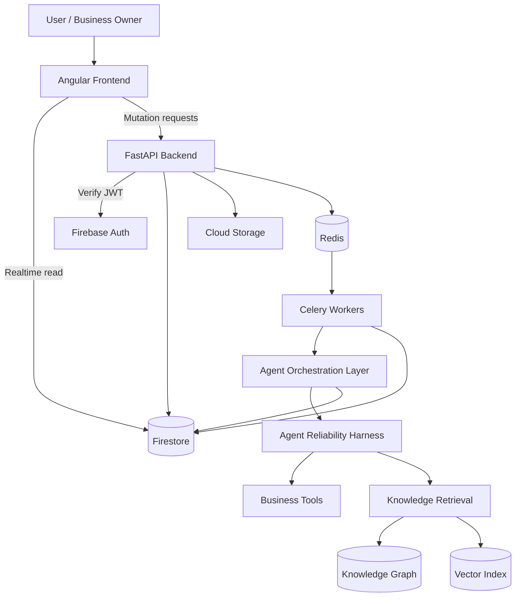

# Product Requirements Document & Design (PRD)

## FLAE Agent — AI Workforce Platform for SMBs in Vietnam

- **Phiên bản:** v0.3
- **Ngày cập nhật:** 2026-05-04
- **Trạng thái:** Draft cập nhật sau khi chốt phạm vi kênh inbox MVP và bổ sung Agent Reliability Harness
- **Phạm vi MVP đề xuất:** Chat Agent, Analyst Agent, Voice Agent, Knowledge Base, Omnichannel Inbox với Facebook Messenger + Zalo OA + Website Chat, Morning Briefing, Agent Reliability Harness

---

## 0. Tóm tắt cập nhật so với bản trước

Bản PRD này cập nhật từ định hướng ban đầu của FLAE Agent và bổ sung các quyết định quan trọng:

1. **Tập trung MVP vào 3 agent chính:**
   - **Chat Agent:** chăm sóc khách hàng đa kênh.
   - **Analyst Agent:** phân tích dữ liệu, tạo báo cáo, phát hiện bất thường.
   - **Voice Agent:** gọi/nhận cuộc gọi, tóm tắt nội dung, hỗ trợ chăm sóc khách hàng bằng giọng nói.

2. **Growth Agent / Growth Hub được giữ trong tầm nhìn sản phẩm nhưng không phải trọng tâm MVP.**
   - Growth Hub vẫn xuất hiện trong roadmap post-MVP.
   - MVP ưu tiên giải quyết pain point vận hành, CSKH và báo cáo.

3. **Bổ sung Agent Reliability Harness.**
   - Đây là lớp kiểm soát độ tin cậy cho toàn bộ agent.
   - Bao gồm Agent Contract, guardrails, approval queue, audit log, evals và feedback loop.
   - Mục tiêu: giúp AI hoạt động như “nhân viên ảo có kiểm soát”, không chỉ là chatbot tự do.

4. **Làm rõ kiến trúc “Firestore Real-time First”.**
   - Frontend đọc dữ liệu realtime trực tiếp từ Firestore.
   - Backend chỉ xử lý mutation, validation, business logic, background jobs và agent execution.
   - Không định nghĩa RESTful GET API cho các tài nguyên có thể đọc trực tiếp bằng Firestore listeners.

5. **Bổ sung collection model sơ bộ trên Firestore.**
   - Phục vụ UI realtime, agent runs, tool calls, approval queue, inbox, knowledge base và báo cáo.

6. **Chốt phạm vi kênh Omnichannel Inbox cho MVP.**
   - MVP sẽ hỗ trợ trước **Facebook Messenger**, **Zalo OA** và **Website Chat**.
   - Website Chat là kênh first-party do FLAE kiểm soát widget và realtime UX.
   - Facebook Messenger và Zalo OA là hai kênh third-party ưu tiên do phù hợp hành vi bán hàng/CSKH của SMB Việt Nam.

---

## 1. Tổng quan dự án (Project Overview)

### 1.1 Tên dự án

**FLAE Agent**

### 1.2 Mô tả

FLAE Agent là một hệ sinh thái AI hoạt động như một **đội ngũ nhân viên ảo trọn gói** dành riêng cho các doanh nghiệp vừa và nhỏ (SMBs) tại Việt Nam.

Thay vì yêu cầu chủ doanh nghiệp sử dụng nhiều phần mềm phức tạp, FLAE biến các tác vụ vận hành hằng ngày thành trải nghiệm hội thoại đơn giản:

- nhận báo cáo doanh thu buổi sáng;
- theo dõi tình hình khách hàng;
- trả lời tin nhắn đa kênh;
- phân tích dữ liệu bán hàng;
- tóm tắt cuộc gọi;
- cảnh báo vấn đề vận hành;
- đề xuất hành động tiếp theo.

FLAE được xây dựng quanh cơ chế **bộ nhớ dài hạn** gồm Knowledge Base, Knowledge Graph và lịch sử tương tác doanh nghiệp. Nhờ đó, các agent có thể hiểu bối cảnh doanh nghiệp, sản phẩm, chính sách, khách hàng và quy trình nội bộ.

### 1.3 Tầm nhìn

Đơn giản hóa việc quản lý và tăng trưởng doanh nghiệp bằng trợ lý AI thân thiện, giúp tự động hóa khâu vận hành nhưng vẫn giữ quyền kiểm soát cho con người.

### 1.4 Định vị sản phẩm

> FLAE Agent là “đội ngũ nhân viên AI có kiểm soát” cho SMB Việt Nam: dễ dùng như chat, nhưng có memory, phân quyền, phê duyệt, audit log và human takeover như một hệ thống vận hành thật.

### 1.5 Đối tượng người dùng mục tiêu

**Primary users:**

- Chủ shop online.
- Chủ doanh nghiệp nhỏ.
- Quản lý bán hàng.
- Quản lý vận hành.
- Đội chăm sóc khách hàng nhỏ từ 1–10 người.

**Loại doanh nghiệp phù hợp giai đoạn đầu:**

- Shop thương mại điện tử.
- Local brand.
- Dịch vụ làm đẹp/spa/phòng khám nhỏ.
- Trung tâm đào tạo nhỏ.
- F&B quy mô nhỏ.
- Doanh nghiệp bán hàng qua Facebook, Zalo, website, hotline.

### 1.6 Vấn đề cần giải quyết

SMBs tại Việt Nam thường gặp các vấn đề:

1. **Quá nhiều kênh giao tiếp khách hàng.**
   - Facebook, Zalo, website, hotline, email, sàn thương mại điện tử.
   - Tin nhắn dễ bị sót, phản hồi không nhất quán.

2. **Thiếu nhân sự vận hành chuyên biệt.**
   - Chủ doanh nghiệp phải kiêm bán hàng, CSKH, phân tích số liệu, marketing.

3. **Dữ liệu rời rạc.**
   - Doanh thu, đơn hàng, khách hàng, tồn kho, chat và cuộc gọi không nằm cùng một nơi.

4. **Báo cáo khó hiểu, khó hành động.**
   - Nhiều phần mềm có dashboard nhưng không trả lời được câu hỏi: “Hôm nay tôi cần làm gì?”

5. **AI hiện tại dễ trả lời sai hoặc vượt quyền.**
   - Doanh nghiệp cần AI tự động hóa nhưng vẫn phải kiểm soát được hành động quan trọng.

---

## 2. Nguyên tắc sản phẩm

### 2.1 Conversational-first

Người dùng tương tác với hệ thống như đang giao việc cho nhân viên, không phải như đang cấu hình phần mềm phức tạp.

### 2.2 Human-in-control

AI có thể tự động hóa nhiều tác vụ, nhưng các hành động nhạy cảm phải có cơ chế phê duyệt, chỉnh sửa hoặc takeover bởi con người.

### 2.3 Memory-first

Agent phải có khả năng nhớ bối cảnh doanh nghiệp, chính sách, sản phẩm, khách hàng và các tương tác trước đó.

### 2.4 Realtime-first

Giao diện phải phản ánh trạng thái mới nhất của inbox, báo cáo, agent run, approval queue và cảnh báo theo thời gian thực.

### 2.5 Reliability-first

Agent không chỉ cần “thông minh” mà phải đáng tin cậy, có kiểm soát, có log, có đánh giá và có khả năng học từ lỗi lặp lại.

---

## 3. Phạm vi MVP

### 3.1 In scope cho MVP

MVP tập trung vào các module sau:

1. **Authentication & Workspace Setup**
   - Đăng nhập.
   - Tạo workspace doanh nghiệp.
   - Thiết lập thông tin cơ bản: tên doanh nghiệp, ngành hàng, mô tả sản phẩm/dịch vụ.

2. **Knowledge Base / Trí Nhớ**
   - Upload tài liệu.
   - Thêm link sản phẩm/chính sách.
   - Lưu tri thức phục vụ Chat Agent, Analyst Agent và Voice Agent.

3. **My Agent Team**
   - Quản lý Chat Agent, Analyst Agent, Voice Agent.
   - Bật/tắt agent.
   - Xem trạng thái hoạt động.
   - Xem phạm vi quyền hạn cơ bản.

4. **Omnichannel Inbox**
   - Giao diện hộp thư hợp nhất.
   - Hỗ trợ trước 3 kênh MVP: **Facebook Messenger**, **Zalo OA** và **Website Chat**.
   - Hỗ trợ luồng hội thoại khách hàng.
   - AI draft reply.
   - AI auto-reply cho trường hợp an toàn.
   - Human takeover.

5. **Morning Briefing**
   - Bảng tin dạng feed.
   - Báo cáo doanh thu/tình hình khách hàng/tác vụ cần xử lý.
   - Cảnh báo từ Analyst Agent.

6. **Voice Agent MVP**
   - Ghi nhận cuộc gọi hoặc transcript.
   - Tóm tắt nội dung cuộc gọi.
   - Trích xuất intent, thông tin khách hàng, việc cần làm.
   - Chưa bắt buộc tự động gọi outbound trong MVP đầu tiên nếu chưa đủ hạ tầng.

7. **Agent Reliability Harness**
   - Agent contracts.
   - Tool guardrails.
   - Approval queue.
   - Audit log.
   - Evals nội bộ cơ bản.

### 3.2 Out of scope cho MVP

Các tính năng sau để post-MVP:

- Growth Hub đầy đủ.
- Growth Agent tự tạo chiến dịch marketing.
- Tự động chạy ads.
- Tích hợp sâu nhiều sàn thương mại điện tử cùng lúc.
- Workflow automation phức tạp dạng Zapier.
- Tùy biến no-code nâng cao.
- Multi-branch enterprise management.
- AI tự động ra quyết định tài chính hoặc khuyến mãi không cần duyệt.

---

## 4. Các tính năng chính

## 4.1 Morning Briefing — Bảng tin buổi sáng

### Mô tả

Morning Briefing là dashboard dạng **conversational feed**, nơi các nhân viên AI chủ động gửi báo cáo, cảnh báo và đề xuất hành động.

### Mục tiêu

Thay vì bắt người dùng mở nhiều dashboard, hệ thống tự tổng hợp và trình bày những gì quan trọng nhất trong ngày.

### Nội dung briefing MVP

- Tổng quan doanh thu hôm qua/hôm nay.
- Số lượng khách mới.
- Số hội thoại chưa xử lý.
- Các khách hàng cần phản hồi gấp.
- Cảnh báo bất thường từ Analyst Agent.
- Gợi ý hành động trong ngày.

### User story

> Là chủ doanh nghiệp, tôi muốn mở FLAE vào buổi sáng và biết ngay hôm nay cần tập trung vào điều gì.

### Acceptance criteria

- Người dùng thấy feed briefing sau khi đăng nhập.
- Mỗi item có tiêu đề, nội dung ngắn, agent gửi, thời gian tạo và CTA nếu có.
- Item có thể điều hướng sang inbox, báo cáo hoặc approval queue.
- Feed cập nhật realtime khi có item mới.

---

## 4.2 My Agent Team — Đội ngũ nhân viên ảo

### Mô tả

My Agent Team là nơi người dùng quản lý các agent đang hoạt động trong workspace.

### Agent trong MVP

| Agent | Vai trò | Trạng thái MVP |
|---|---|---|
| Chat Agent | Chăm sóc khách hàng đa kênh | Bắt buộc |
| Analyst Agent | Phân tích số liệu, tạo báo cáo, phát hiện bất thường | Bắt buộc |
| Voice Agent | Xử lý cuộc gọi, transcript, tóm tắt và follow-up | Bắt buộc ở mức cơ bản |
| Growth Agent | Đề xuất chiến dịch tăng trưởng | Post-MVP |

### Chức năng MVP

- Xem danh sách agent.
- Bật/tắt từng agent.
- Xem mô tả vai trò.
- Xem quyền hạn cơ bản.
- Xem trạng thái: active, paused, needs setup, error.
- Điều hướng đến cấu hình chi tiết của agent.

### Nguyên tắc quyền hạn

Mỗi agent phải có **Agent Contract** xác định:

- vai trò;
- nhiệm vụ được phép làm;
- tool được phép gọi;
- hành động cần phê duyệt;
- tình huống phải chuyển người;
- output schema bắt buộc.

---

## 4.3 Knowledge Base — Trí Nhớ doanh nghiệp

### Mô tả

Knowledge Base là bộ não nơi các agent lấy thông tin về doanh nghiệp, sản phẩm, dịch vụ, chính sách, kịch bản tư vấn và dữ liệu nội bộ.

### Mục tiêu

Giúp agent trả lời và phân tích dựa trên tri thức thật của doanh nghiệp, không dựa vào suy đoán.

### Input MVP

- Upload file PDF, DOCX, TXT, CSV.
- Thêm link sản phẩm/chính sách.
- Nhập thủ công thông tin doanh nghiệp.
- Thêm FAQ.
- Thêm chính sách đổi trả, bảo hành, thanh toán, giao hàng.

### Processing pipeline đề xuất

1. Người dùng upload tài liệu hoặc link.
2. Backend lưu file gốc vào Cloud Storage.
3. Celery job xử lý tài liệu:
   - extract text;
   - chunking;
   - embedding;
   - entity extraction;
   - relationship extraction;
   - upsert vào Knowledge Graph / vector index.
4. Firestore cập nhật trạng thái xử lý realtime.
5. Agent có thể truy xuất tri thức qua retrieval tool.

### Knowledge Graph / Memory Layer

FLAE nên sử dụng kiến trúc memory lai:

- **Document chunks:** phục vụ semantic search và citation.
- **Entities:** sản phẩm, chính sách, khách hàng, chiến dịch, nhân viên, đơn hàng.
- **Relationships:** sản phẩm thuộc danh mục nào, chính sách áp dụng cho sản phẩm nào, khách hàng từng hỏi vấn đề gì.
- **Temporal facts:** thông tin có thời hạn như khuyến mãi, tồn kho, cam kết giao hàng.

### Yêu cầu quan trọng

- Agent phải ưu tiên thông tin từ Knowledge Base của workspace.
- Nếu không tìm thấy thông tin chắc chắn, agent không được bịa.
- Câu trả lời nhạy cảm nên kèm nguồn hoặc trích dẫn nội bộ.
- Người dùng có thể xem trạng thái tài liệu: pending, processing, ready, failed.

---

## 4.4 Omnichannel Inbox — Hộp thư đa kênh

### Mô tả

Omnichannel Inbox hợp nhất các cuộc hội thoại khách hàng từ nhiều kênh vào một giao diện duy nhất.

### Kênh hỗ trợ trong MVP

MVP sẽ hỗ trợ trước 3 kênh chính:

| Kênh | Phạm vi MVP | Ghi chú |
|---|---|---|
| Website Chat | P0 | Widget chat nhúng vào website của doanh nghiệp, do FLAE kiểm soát trải nghiệm realtime. |
| Facebook Messenger | P0 | Kết nối Facebook Page/Messenger để đồng bộ hội thoại, nhận tin nhắn, gửi phản hồi và AI draft/auto-reply an toàn. |
| Zalo OA | P0 | Kết nối Zalo Official Account để đồng bộ hội thoại, nhận tin nhắn, gửi phản hồi và AI draft/auto-reply an toàn. |

Manual/import conversation chỉ dùng cho demo nội bộ hoặc migration, không phải kênh vận hành chính trong MVP.

### Chức năng MVP

- Xem danh sách hội thoại.
- Xem nội dung tin nhắn.
- Gửi trả lời thủ công.
- Chat Agent gợi ý câu trả lời.
- Chat Agent tự động trả lời trong tình huống an toàn.
- Human takeover.
- Gắn trạng thái hội thoại: new, open, waiting, resolved.
- Gắn nhãn intent: hỏi giá, tư vấn sản phẩm, đổi trả, khiếu nại, đặt lịch, khác.

### AI response mode

| Mode | Mô tả | Dùng khi |
|---|---|---|
| Draft only | AI chỉ soạn nháp | Giai đoạn đầu, câu hỏi nhạy cảm |
| Auto-reply safe | AI tự trả lời nếu confidence cao và không nhạy cảm | FAQ, chính sách rõ ràng |
| Human takeover | Người dùng tiếp quản | Khiếu nại, hoàn tiền, giá đặc biệt, lỗi hệ thống |

### Acceptance criteria

- Người dùng có thể xem inbox realtime.
- Khi khách gửi tin mới, hội thoại cập nhật trong Firestore và UI.
- AI draft được hiển thị riêng với tin nhắn đã gửi.
- Người dùng có thể approve/edit/reject draft.
- Mọi hành động gửi tin phải có audit log.

---

## 4.5 Analyst Agent — Trợ lý phân tích

### Mô tả

Analyst Agent phân tích dữ liệu bán hàng, hội thoại, khách hàng và vận hành để tạo báo cáo dễ hiểu, tập trung vào hành động.

### Nhiệm vụ MVP

- Tạo báo cáo tổng quan ngày/tuần.
- Phát hiện bất thường:
  - doanh thu giảm mạnh;
  - lượng hội thoại tăng bất thường;
  - nhiều khách hỏi cùng một vấn đề;
  - sản phẩm được hỏi nhiều nhưng không chuyển đổi.
- Trả lời câu hỏi phân tích bằng ngôn ngữ tự nhiên.
- Tạo item cho Morning Briefing.

### Ví dụ câu hỏi

- “Hôm qua doanh thu giảm vì sao?”
- “Khách đang hỏi nhiều nhất về sản phẩm nào?”
- “Có hội thoại nào chưa xử lý quá lâu không?”
- “Tuần này kênh nào đem lại nhiều khách nhất?”

### Yêu cầu reliability

- Analyst Agent phải trích nguồn dữ liệu hoặc khoảng thời gian phân tích.
- Không được tự suy diễn nếu thiếu dữ liệu.
- Phân biệt rõ giữa “số liệu thực tế” và “nhận định/gợi ý”.
- Các báo cáo quan trọng phải lưu lại để audit.

---

## 4.6 Voice Agent — Trợ lý giọng nói

### Mô tả

Voice Agent hỗ trợ xử lý tương tác bằng giọng nói, bắt đầu từ transcript, tóm tắt và follow-up sau cuộc gọi.

### Phạm vi MVP

MVP nên triển khai Voice Agent ở mức an toàn trước:

- nhận transcript từ cuộc gọi;
- tóm tắt nội dung;
- trích xuất thông tin khách hàng;
- phát hiện intent;
- tạo follow-up task;
- tạo draft tin nhắn sau cuộc gọi;
- lưu lịch sử vào customer profile.

### Post-MVP

- Nhận cuộc gọi inbound tự động.
- Gọi outbound theo kịch bản.
- Nhắc lịch/hẹn lịch qua giọng nói.
- Voice bot xử lý FAQ cơ bản.
- Live call handoff cho người thật.

### Yêu cầu reliability

Voice Agent phải chuyển người hoặc yêu cầu xác nhận khi:

- khách hàng tức giận;
- khách hỏi điều khoản giá/hoàn tiền nhạy cảm;
- transcript không rõ;
- confidence thấp;
- khách yêu cầu cam kết pháp lý/tài chính/y tế.

---

## 4.7 Agent Reliability Harness — Lớp kiểm soát độ tin cậy

### Mô tả

Agent Reliability Harness là lớp vận hành bao quanh các agent, đảm bảo agent hoạt động đúng vai trò, đúng quyền hạn, có kiểm tra, có phê duyệt, có log và có đánh giá chất lượng.

Đây là điểm khác biệt quan trọng của FLAE so với chatbot/RAG thông thường.

### Mục tiêu

- Giảm hallucination.
- Ngăn AI vượt quyền.
- Kiểm soát tool có side effect.
- Cho phép người dùng approve/edit/reject hành động AI.
- Ghi lại toàn bộ quá trình agent ra quyết định.
- Tạo nền tảng evaluation để cải thiện agent liên tục.

### Thành phần chính

#### 4.7.1 Agent Contract Registry

Mỗi agent có một contract xác định:

```yaml
agent_id: chat_agent
role: "Chăm sóc khách hàng"
allowed_tools:
  - retrieve_knowledge
  - draft_customer_reply
  - classify_conversation_intent
  - send_customer_message
requires_approval:
  - refund_request
  - discount_offer
  - order_cancellation
  - sensitive_policy_answer
must_escalate_when:
  - customer_angry
  - low_confidence
  - missing_knowledge
  - legal_or_payment_issue
output_schema:
  required:
    - answer
    - confidence
    - sources
    - escalation_required
```

#### 4.7.2 Tool Guardrails

Mọi tool quan trọng phải có validation trước và sau khi chạy.

Ví dụ tool cần guardrail:

- gửi tin nhắn cho khách;
- tạo nháp trả lời;
- cập nhật trạng thái hội thoại;
- tạo follow-up task;
- tạo báo cáo;
- lưu knowledge mới;
- gửi voice call/outbound call trong tương lai.

Guardrail cần kiểm tra:

- workspace/tenant hợp lệ;
- quyền của agent;
- input đúng schema;
- không chứa thông tin nội bộ không nên gửi khách;
- không đưa ra giảm giá/hoàn tiền nếu chưa được duyệt;
- confidence đủ cao;
- nguồn tri thức có tồn tại nếu câu trả lời dựa trên KB.

#### 4.7.3 Human Approval Queue

Hàng chờ phê duyệt cho các hành động nhạy cảm.

Người dùng có thể:

- **Approve:** cho phép AI thực hiện.
- **Edit:** chỉnh nội dung hoặc tham số rồi thực hiện.
- **Reject:** từ chối và ghi feedback.

Các trường hợp cần approval:

- hoàn tiền;
- hủy đơn;
- đề xuất giảm giá riêng;
- gửi broadcast/campaign;
- trả lời khiếu nại nghiêm trọng;
- thay đổi thông tin khách hàng quan trọng;
- AI confidence thấp nhưng vẫn có đề xuất.

#### 4.7.4 Audit Log & Trace

Mỗi agent run cần ghi lại:

- agent nào chạy;
- input là gì;
- context/retrieval nào được sử dụng;
- tool nào được gọi;
- output là gì;
- confidence;
- có cần escalation không;
- ai approve/edit/reject;
- thời gian xử lý;
- lỗi nếu có.

#### 4.7.5 Evaluation Harness

Bộ kiểm thử chất lượng agent.

MVP cần có:

- test cases cho Chat Agent;
- test cases cho Analyst Agent;
- test cases cho Voice Agent transcript summary;
- đánh giá output theo schema;
- đánh giá hallucination cơ bản;
- replay các cuộc hội thoại lỗi.

Ví dụ eval case:

```json
{
  "agent_id": "chat_agent",
  "input": "Shop có đổi size không?",
  "knowledge_context": "Chính sách đổi size trong 7 ngày nếu sản phẩm còn tag.",
  "expected_behavior": "Trả lời đúng chính sách, không bịa thêm điều kiện.",
  "must_include": ["7 ngày", "còn tag"],
  "must_not_include": ["hoàn tiền 100%", "đổi bất kỳ lúc nào"]
}
```

#### 4.7.6 Feedback Loop

Khi người dùng reject hoặc sửa câu trả lời của AI, hệ thống nên lưu feedback để:

- cải thiện prompt;
- cập nhật KB;
- tạo test case mới;
- phát hiện rule cần thêm vào guardrail;
- cải thiện agent contract.

---

## 4.8 Growth Hub — Trung tâm tăng trưởng

### Trạng thái

**Post-MVP.**

### Mô tả

Growth Hub là nơi Growth Agent đề xuất các hành động marketing và tăng trưởng dạng ngắn gọn, dễ thực hiện.

### Tính năng tương lai

- Gợi ý campaign dựa trên dữ liệu bán hàng.
- Đề xuất ưu đãi cho nhóm khách hàng cụ thể.
- Tạo nội dung bài đăng.
- Tạo kịch bản chăm sóc lại khách cũ.
- Đề xuất A/B test đơn giản.

### Lưu ý reliability

Mọi hành động marketing có tác động ra bên ngoài, đặc biệt broadcast hoặc ưu đãi giá, phải cần người duyệt.

---

## 5. Luồng trải nghiệm người dùng chính

## 5.1 Onboarding workspace

1. Người dùng đăng ký/đăng nhập.
2. Tạo workspace doanh nghiệp.
3. Nhập thông tin cơ bản:
   - tên doanh nghiệp;
   - ngành hàng;
   - mô tả sản phẩm/dịch vụ;
   - kênh bán chính.
4. Upload tài liệu hoặc thêm FAQ.
5. Bật Chat Agent, Analyst Agent, Voice Agent.
6. Kết nối các kênh inbox MVP: Website Chat, Facebook Messenger và Zalo OA.
7. Hệ thống tạo Morning Briefing mẫu.

## 5.2 Xử lý tin nhắn khách hàng

1. Khách gửi tin nhắn qua Website Chat, Facebook Messenger hoặc Zalo OA.
2. Tin nhắn được lưu vào Firestore.
3. UI inbox cập nhật realtime.
4. Chat Agent phân loại intent.
5. Chat Agent truy xuất Knowledge Base.
6. Harness kiểm tra confidence và policy.
7. Nếu an toàn: AI tạo draft hoặc auto-reply.
8. Nếu nhạy cảm: tạo approval request.
9. Người dùng approve/edit/reject.
10. Hệ thống gửi tin và lưu audit log.

## 5.3 Morning Briefing

1. Celery job hoặc scheduled agent run tổng hợp dữ liệu.
2. Analyst Agent phân tích số liệu.
3. Harness kiểm tra output schema.
4. Item được lưu vào `briefing_items`.
5. Frontend hiển thị realtime trong feed.
6. Người dùng click CTA để xử lý việc cần làm.

## 5.4 Voice call summary

1. Cuộc gọi được ghi nhận hoặc import transcript.
2. Voice Agent tóm tắt nội dung.
3. Trích xuất intent, thông tin khách hàng, việc cần làm.
4. Nếu thông tin không rõ: đánh dấu cần người kiểm tra.
5. Lưu summary vào conversation/customer profile.
6. Tạo follow-up task nếu cần.

---

## 6. Yêu cầu chức năng chi tiết

## 6.1 Authentication & Workspace

| ID | Requirement | Priority |
|---|---|---|
| AUTH-01 | Người dùng có thể đăng nhập bằng Firebase Auth | P0 |
| AUTH-02 | Người dùng có thể tạo workspace doanh nghiệp | P0 |
| AUTH-03 | Workspace có tenant_id riêng | P0 |
| AUTH-04 | Dữ liệu phải phân tách theo tenant | P0 |
| AUTH-05 | Hỗ trợ role cơ bản: owner, admin, member | P1 |

## 6.2 Knowledge Base

| ID | Requirement | Priority |
|---|---|---|
| KB-01 | Upload tài liệu vào Cloud Storage | P0 |
| KB-02 | Lưu metadata tài liệu trong Firestore | P0 |
| KB-03 | Background job xử lý tài liệu | P0 |
| KB-04 | Hiển thị trạng thái xử lý realtime | P0 |
| KB-05 | Agent retrieval từ KB | P0 |
| KB-06 | Quản lý FAQ thủ công | P1 |
| KB-07 | Hiển thị nguồn tri thức được dùng trong câu trả lời | P1 |
| KB-08 | Entity/relationship extraction cho Knowledge Graph | P1 |

## 6.3 Omnichannel Inbox

| ID | Requirement | Priority |
|---|---|---|
| INBOX-01 | Hiển thị danh sách hội thoại realtime | P0 |
| INBOX-02 | Hiển thị tin nhắn trong hội thoại | P0 |
| INBOX-03 | Gửi tin nhắn thủ công | P0 |
| INBOX-04 | AI tạo draft reply | P0 |
| INBOX-05 | Human takeover | P0 |
| INBOX-06 | Approve/edit/reject AI draft | P0 |
| INBOX-07 | Auto-reply cho câu hỏi an toàn | P1 |
| INBOX-08 | Gắn nhãn intent | P1 |
| INBOX-09 | Kết nối Website Chat widget | P0 |
| INBOX-10 | Kết nối Facebook Messenger/Page | P0 |
| INBOX-11 | Kết nối Zalo OA | P0 |
| INBOX-12 | Đồng bộ trạng thái kênh/integration health | P1 |

## 6.4 Analyst Agent

| ID | Requirement | Priority |
|---|---|---|
| ANA-01 | Tạo daily briefing | P0 |
| ANA-02 | Tóm tắt số liệu chính | P0 |
| ANA-03 | Phát hiện hội thoại quá hạn xử lý | P0 |
| ANA-04 | Phát hiện bất thường doanh thu/hội thoại | P1 |
| ANA-05 | Trả lời câu hỏi phân tích bằng chat | P1 |
| ANA-06 | Phân biệt fact và insight trong output | P0 |

## 6.5 Voice Agent

| ID | Requirement | Priority |
|---|---|---|
| VOICE-01 | Lưu transcript cuộc gọi | P0 |
| VOICE-02 | Tóm tắt transcript | P0 |
| VOICE-03 | Trích xuất intent và việc cần làm | P0 |
| VOICE-04 | Tạo follow-up task | P1 |
| VOICE-05 | Đánh dấu transcript confidence thấp | P0 |
| VOICE-06 | Gọi outbound tự động | Post-MVP |

## 6.6 Agent Reliability Harness

| ID | Requirement | Priority |
|---|---|---|
| HAR-01 | Mỗi agent có Agent Contract | P0 |
| HAR-02 | Tool calls được ghi log | P0 |
| HAR-03 | Tool guardrails cho hành động có side effect | P0 |
| HAR-04 | Approval queue cho hành động nhạy cảm | P0 |
| HAR-05 | Người dùng có thể approve/edit/reject | P0 |
| HAR-06 | Lưu agent run trace | P0 |
| HAR-07 | Evals cơ bản cho Chat Agent | P1 |
| HAR-08 | Evals cơ bản cho Analyst/Voice Agent | P1 |
| HAR-09 | Feedback loop từ reject/edit | P1 |

---

## 7. Kiến trúc hệ thống

## 7.1 Nguyên tắc kiến trúc

Dự án áp dụng mô hình **Firestore Real-time First**:

- Frontend đọc dữ liệu trực tiếp từ Firestore bằng Firebase Web SDK và realtime listeners.
- Backend không cung cấp RESTful GET API cho các tài nguyên có thể đọc từ Firestore.
- Backend xử lý toàn bộ mutation: POST, PATCH, DELETE.
- Backend chịu trách nhiệm validation, business logic, authorization, background processing và agent execution.
- Các tác vụ nặng chạy bất đồng bộ qua Celery + Redis.

## 7.2 Frontend

- **Framework:** Angular 19+.
- **Component model:** Standalone components.
- **Styling:** TailwindCSS v4.
- **Design system:** Green Growth Design System.
- **State management:** Angular Signals + NgRx SignalStore.
- **BaaS:** Firebase Auth, Firestore, Cloud Storage qua `@angular/fire`.
- **Realtime data:** Firestore listeners.

## 7.3 Backend

- **Framework:** FastAPI.
- **Python:** >= 3.11.
- **Dependency management:** `uv`.
- **Firebase Admin:** xác thực, Firestore server-side writes, Cloud Storage operations.
- **ORM/Validation:** Firedantic + Pydantic models.
- **Background tasks:** Celery.
- **Broker/cache:** Redis.
- **Authentication:** Firebase Session JWT verification.

## 7.4 Agent Orchestration Layer

Đề xuất sử dụng LangGraph hoặc orchestration tương đương để quản lý:

- agent state;
- workflow state;
- multi-step reasoning;
- tool calls;
- pause/resume;
- human-in-the-loop;
- routing giữa Chat/Analyst/Voice Agent.

### Nguyên tắc

LangGraph/state machine không thay thế harness. Nó là lớp điều phối. Harness là lớp kiểm soát quyền hạn, guardrails, approval, audit và eval.

## 7.5 Memory & Knowledge Layer

### Thành phần

- Firestore: metadata, realtime UI state, tenant data, conversations, approval status.
- Cloud Storage: file gốc.
- Graph database: long-term memory, entities, relationships, temporal facts.
- Vector index: semantic retrieval trên document chunks.
- Optional: Graphiti-compatible memory layer để quản lý event-based knowledge graph.

### Lưu ý triển khai

- Có thể bắt đầu bằng một graph database self-hosted hoặc managed tùy ngân sách.
- Vector embeddings có thể lưu trong graph database nếu backend hỗ trợ tốt, hoặc tách sang vector store riêng.
- MVP nên ưu tiên tính ổn định và chi phí thấp hơn là kiến trúc quá phức tạp.

## 7.6 High-level architecture



---

## 8. Firestore collection model sơ bộ

## 8.1 Root structure

```text
tenants/{tenantId}
  users/{userId}
  agents/{agentId}
  agent_contracts/{contractId}
  agent_runs/{runId}
  tool_calls/{toolCallId}
  approvals/{approvalId}
  briefing_items/{itemId}
  conversations/{conversationId}
    messages/{messageId}
  customers/{customerId}
  knowledge_sources/{sourceId}
  knowledge_jobs/{jobId}
  voice_calls/{callId}
  reports/{reportId}
  eval_cases/{evalCaseId}
  eval_runs/{evalRunId}
  integrations/{integrationId}
  audit_logs/{logId}
```

## 8.2 `agents/{agentId}`

```json
{
  "agent_id": "chat_agent",
  "name": "Chat Agent",
  "type": "chat",
  "status": "active",
  "description": "Chăm sóc khách hàng đa kênh",
  "enabled": true,
  "created_at": "timestamp",
  "updated_at": "timestamp"
}
```

## 8.3 `agent_contracts/{contractId}`

```json
{
  "agent_id": "chat_agent",
  "version": "1.0.0",
  "allowed_tools": ["retrieve_knowledge", "draft_reply", "send_message"],
  "requires_approval": ["refund_request", "discount_offer"],
  "must_escalate_when": ["low_confidence", "customer_angry", "missing_knowledge"],
  "output_schema": {},
  "active": true,
  "created_at": "timestamp"
}
```

## 8.4 `agent_runs/{runId}`

```json
{
  "agent_id": "chat_agent",
  "trigger_type": "new_message",
  "status": "completed",
  "input_ref": "conversations/abc/messages/xyz",
  "output_ref": "conversations/abc/messages/draft123",
  "confidence": 0.87,
  "needs_approval": false,
  "error": null,
  "started_at": "timestamp",
  "completed_at": "timestamp"
}
```

## 8.5 `tool_calls/{toolCallId}`

```json
{
  "run_id": "run_123",
  "agent_id": "chat_agent",
  "tool_name": "send_customer_message",
  "status": "approved",
  "input": {},
  "output": {},
  "guardrail_result": {
    "passed": true,
    "reasons": []
  },
  "created_at": "timestamp"
}
```

## 8.6 `approvals/{approvalId}`

```json
{
  "run_id": "run_123",
  "tool_call_id": "tool_123",
  "type": "customer_reply",
  "status": "pending",
  "proposed_action": {},
  "reason": "low_confidence_or_sensitive_policy",
  "reviewed_by": null,
  "reviewed_at": null,
  "created_at": "timestamp"
}
```

## 8.7 `conversations/{conversationId}`

```json
{
  "channel": "website_chat | facebook_messenger | zalo_oa",
  "customer_id": "customer_123",
  "status": "open",
  "assigned_to": "chat_agent",
  "human_takeover": false,
  "last_message_at": "timestamp",
  "intent": "ask_price",
  "created_at": "timestamp",
  "updated_at": "timestamp"
}
```

## 8.8 `integrations/{integrationId}`

```json
{
  "type": "website_chat | facebook_messenger | zalo_oa",
  "status": "active | needs_auth | error | paused",
  "display_name": "Facebook Page ABC",
  "external_account_id": "page_or_oa_id",
  "capabilities": ["receive_message", "send_message", "sync_conversation"],
  "last_sync_at": "timestamp",
  "error": null,
  "created_at": "timestamp",
  "updated_at": "timestamp"
}
```

## 8.9 `knowledge_sources/{sourceId}`

```json
{
  "type": "pdf",
  "title": "Chính sách đổi trả",
  "storage_path": "tenants/t1/kb/policy.pdf",
  "processing_status": "ready",
  "chunk_count": 24,
  "entity_count": 8,
  "created_by": "user_123",
  "created_at": "timestamp",
  "updated_at": "timestamp"
}
```

---

## 9. API mutation endpoints đề xuất

Do frontend đọc bằng Firestore, backend chỉ cần mutation endpoints.

## 9.1 Workspace & setup

```text
POST /workspaces
PATCH /workspaces/{tenant_id}
POST /workspaces/{tenant_id}/members
DELETE /workspaces/{tenant_id}/members/{user_id}
```

## 9.2 Knowledge Base

```text
POST /knowledge-sources
POST /knowledge-sources/{source_id}/reprocess
DELETE /knowledge-sources/{source_id}
POST /knowledge-faqs
PATCH /knowledge-faqs/{faq_id}
DELETE /knowledge-faqs/{faq_id}
```

## 9.3 Inbox

```text
POST /conversations/{conversation_id}/messages
POST /conversations/{conversation_id}/takeover
POST /conversations/{conversation_id}/release-takeover
PATCH /conversations/{conversation_id}/status
```

## 9.4 Agent actions

```text
POST /agent-runs
POST /agent-runs/{run_id}/cancel
POST /agent-runs/{run_id}/retry
POST /agent-runs/{run_id}/feedback
```

## 9.5 Approval queue

```text
POST /approvals/{approval_id}/approve
POST /approvals/{approval_id}/edit
POST /approvals/{approval_id}/reject
```

## 9.6 Integrations

```text
POST /integrations/website-chat
POST /integrations/facebook-messenger/connect
POST /integrations/zalo-oa/connect
PATCH /integrations/{integration_id}
DELETE /integrations/{integration_id}
POST /integrations/{integration_id}/sync
```

## 9.7 Webhooks

```text
POST /webhooks/facebook-messenger
POST /webhooks/zalo-oa
POST /webhooks/website-chat
```

Webhook endpoints phải verify signature/token của từng nền tảng trước khi ghi dữ liệu vào Firestore.

---

## 10. Security, privacy & permissions

## 10.1 Tenant isolation

- Mọi document phải nằm trong tenant namespace hoặc có `tenant_id` bắt buộc.
- Firestore Security Rules phải đảm bảo user chỉ đọc/ghi dữ liệu thuộc workspace của mình.
- Backend mutation phải verify JWT và role trước khi ghi dữ liệu.

## 10.2 Role-based access

| Role | Quyền |
|---|---|
| Owner | Toàn quyền workspace, billing, integrations, agent settings |
| Admin | Quản lý agent, inbox, KB, approvals |
| Member | Xử lý inbox, xem briefing, gửi phản hồi |
| Viewer | Chỉ xem báo cáo và briefing |

## 10.3 AI permissions

Agent không phải user toàn quyền. Mỗi agent phải bị giới hạn bởi Agent Contract.

Ví dụ:

- Chat Agent không được xóa khách hàng.
- Analyst Agent không được gửi tin nhắn cho khách.
- Voice Agent không được cam kết hoàn tiền.
- Growth Agent không được gửi broadcast nếu chưa được duyệt.

## 10.4 Data privacy

- Không đưa thông tin nhạy cảm của khách hàng vào output không cần thiết.
- Log cần được kiểm soát, tránh lưu raw secret/token.
- Tích hợp bên thứ ba phải lưu token an toàn.
- Cần có cơ chế xóa dữ liệu khách hàng nếu doanh nghiệp yêu cầu.

---

## 11. UI/UX Design System — Green Growth

### 11.1 Nguyên tắc trải nghiệm

Giao diện phải tạo cảm giác người dùng đang giao tiếp với một đội ngũ nhân viên đáng tin cậy.

Từ khóa trải nghiệm:

- thân thiện;
- rõ ràng;
- có kiểm soát;
- realtime;
- ít thuật ngữ kỹ thuật;
- tập trung vào hành động tiếp theo.

### 11.2 Visual style

- **Primary Accent:** Vibrant Green `#10B981`.
- **Background:** Soft Mint `#F4FBF7`.
- **Headings:** Outfit.
- **Body:** Plus Jakarta Sans.
- **Layout:** Conversational cards, soft borders, subtle shadows.

### 11.3 Màn hình chính MVP

1. Login / Signup.
2. Workspace onboarding.
3. Morning Briefing feed.
4. My Agent Team.
5. Knowledge Base.
6. Omnichannel Inbox.
7. Conversation detail.
8. Approval Queue.
9. Analyst Reports.
10. Voice Call Summaries.
11. Settings / Integrations.

### 11.4 UX cho approval

Approval card cần hiển thị:

- agent đề xuất hành động;
- lý do cần duyệt;
- nội dung trước khi gửi;
- nguồn tri thức được dùng;
- confidence;
- nút Approve, Edit, Reject.

---

## 12. Non-functional requirements

## 12.1 Performance

- Inbox realtime update dưới 1–2 giây sau khi Firestore có dữ liệu mới.
- AI draft reply nên xuất hiện trong khoảng thời gian chấp nhận được cho CSKH.
- Background jobs không được block UI.

## 12.2 Reliability

- Tool calls có side effect phải idempotent nếu có thể.
- Agent run thất bại phải có trạng thái failed và error reason.
- Có thể retry một agent run.
- Không gửi tin nhắn khách hàng nếu guardrail fail.

## 12.3 Observability

- Log agent runs.
- Log tool calls.
- Log approval decisions.
- Log integration errors.
- Dashboard nội bộ cho failed jobs và failed agent runs.

## 12.4 Scalability

- Firestore schema phải tối ưu cho realtime query theo tenant.
- Conversations/messages nên phân cấp để tránh document quá lớn.
- Background workers có thể scale ngang.
- Knowledge processing tách khỏi request lifecycle.

---

## 13. Success metrics

## 13.1 Product metrics

- Số workspace tạo mới.
- Tỉ lệ hoàn tất onboarding.
- Số tài liệu KB được upload.
- Số hội thoại được xử lý trong inbox.
- Số AI drafts được tạo.
- Tỉ lệ AI draft được approve.
- Tỉ lệ human takeover.
- Số briefing items được đọc/click.

## 13.2 Agent quality metrics

- Answer accuracy.
- Hallucination rate.
- Escalation precision.
- Approval rate.
- Edit rate.
- Reject rate.
- Average confidence.
- Tool guardrail failure rate.

## 13.3 Business outcome metrics

- Thời gian phản hồi khách hàng giảm.
- Tỉ lệ bỏ sót tin nhắn giảm.
- Chủ doanh nghiệp đọc báo cáo thường xuyên hơn.
- Số việc cần làm được xử lý từ Morning Briefing.

---

## 14. Roadmap đề xuất

## 14.1 Phase 0 — Foundation

- Khởi tạo frontend Angular.
- Khởi tạo backend FastAPI.
- Firebase Auth + Firestore + Storage.
- Tenant model.
- Firestore Security Rules cơ bản.
- Base UI design system.

## 14.2 Phase 1 — Knowledge Base + Agent Harness core

- Upload tài liệu.
- Knowledge processing pipeline.
- Agent Contract Registry.
- Agent run logs.
- Tool call logs.
- Basic retrieval tool.

## 14.3 Phase 2 — Omnichannel Inbox + Chat Agent

- Inbox UI.
- Conversation/message model.
- Website Chat widget.
- Facebook Messenger connector.
- Zalo OA connector.
- AI draft reply.
- Human takeover.
- Approval queue.
- Guardrails cho send message.

## 14.4 Phase 3 — Analyst Agent + Morning Briefing

- Daily briefing generator.
- Analyst reports.
- Basic anomaly detection.
- Briefing feed realtime.
- Report cards with CTA.

## 14.5 Phase 4 — Voice Agent MVP

- Voice transcript ingestion.
- Call summary.
- Intent extraction.
- Follow-up task.
- Voice confidence/escalation handling.

## 14.6 Phase 5 — Evals & Production Hardening

- Eval cases cho Chat Agent.
- Eval cases cho Analyst/Voice.
- Replay failed traces.
- Internal quality dashboard.
- Better observability.

## 14.7 Phase 6 — Growth Hub post-MVP

- Growth suggestions.
- Campaign drafts.
- Customer segment insights.
- Marketing approval workflow.

---

## 15. Rủi ro và hướng giảm thiểu

| Rủi ro | Mức độ | Hướng giảm thiểu |
|---|---:|---|
| Agent trả lời sai chính sách | Cao | KB citation, confidence threshold, approval, evals |
| AI gửi tin nhắn không phù hợp | Cao | Draft-first, guardrails, human takeover |
| Knowledge Base xử lý tài liệu lỗi | Trung bình | Processing status, retry job, error message rõ ràng |
| Firestore schema khó scale | Trung bình | Thiết kế query-first, subcollection messages |
| Tích hợp Zalo/Facebook phức tạp | Cao | Chuẩn hóa connector adapter, triển khai theo thứ tự Website Chat → Facebook Messenger → Zalo OA, có integration health và fallback draft/manual nếu nền tảng chậm phê duyệt |
| Voice Agent vượt khả năng MVP | Trung bình | Bắt đầu từ transcript summary, chưa cần outbound tự động |
| Chi phí graph/vector database tăng | Trung bình | Bắt đầu kiến trúc tối giản, theo dõi usage, tách storage theo giai đoạn |

---

## 16. Các quyết định sản phẩm hiện tại

| Chủ đề | Quyết định |
|---|---|
| Agent MVP | Chat, Analyst, Voice |
| Growth Hub | Post-MVP |
| Kiến trúc đọc dữ liệu | Firestore Real-time First |
| Backend | FastAPI + Firebase Admin + Firedantic |
| Background jobs | Celery + Redis |
| Frontend | Angular 19+ Standalone + Signals + NgRx SignalStore |
| Memory | Knowledge Base + Knowledge Graph + vector retrieval |
| AI reliability | Agent Reliability Harness là module bắt buộc |
| Human control | Human takeover + approval queue |
| Kênh inbox MVP | Website Chat + Facebook Messenger + Zalo OA |

---

## 17. Câu hỏi còn mở

Các câu hỏi cần quyết định trước khi triển khai chi tiết:

1. Voice Agent MVP sẽ nhận transcript từ nguồn nào: upload file, call provider, hay nhập thủ công?
2. Graph database ban đầu dùng Neo4j, FalkorDB hay một lựa chọn self-hosted khác?
3. Có cần billing/subscription trong MVP không, hay để sau pilot?
4. Bộ ngành/ngách khách hàng đầu tiên nên tập trung vào: retail online, spa/clinic, education hay F&B?
5. Mức độ auto-reply ban đầu: draft-only hay cho phép auto-reply với FAQ an toàn?
6. Cần hỗ trợ tiếng Việt 100% trước hay song ngữ Việt/Anh ngay từ đầu?
7. Thứ tự rollout kỹ thuật cho 3 kênh đã chốt sẽ là Website Chat → Facebook Messenger → Zalo OA hay chạy song song?

---

## 18. Next steps

1. Đặc tả connector cho Website Chat, Facebook Messenger và Zalo OA: auth, webhook, message payload, send-message API, rate limit và error handling.
2. Chốt graph database/memory backend ban đầu.
3. Thiết kế Firestore Security Rules.
4. Thiết kế chi tiết collection model.
5. Viết Agent Contract v1 cho Chat Agent, Analyst Agent, Voice Agent.
6. Tạo bộ eval cases đầu tiên cho Chat Agent theo 3 kênh inbox MVP.
7. Khởi tạo frontend/backend boilerplate.
8. Xây dựng prototype Knowledge Base + Chat Agent draft reply trên Website Chat, sau đó mở rộng sang Facebook Messenger và Zalo OA.
