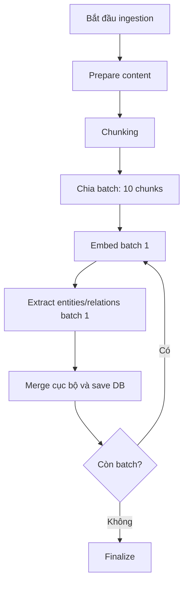
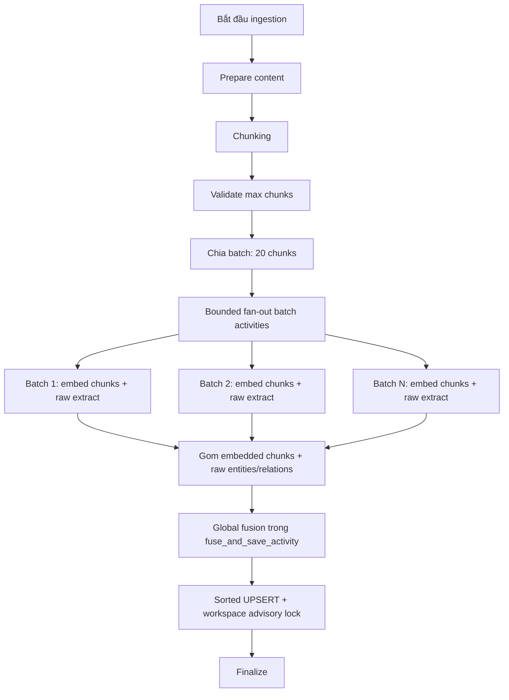

# Tài Liệu Thiết Kế: Tối Ưu Hóa Quy Trình Ingestion TGS-RAG

Tài liệu này mô tả kế hoạch tối ưu ingestion Knowledge Base của FLAE Agents theo bốn mục tiêu: tăng throughput, giới hạn rủi ro rate limit, giữ payload Temporal an toàn, và giảm lock contention khi ghi RAG database.

---

## 1. Hiện Trạng & Vấn Đề

Workflow hiện tại xử lý tài liệu theo batch 10 chunks tuần tự:



Các điểm nghẽn chính:

1. **Sequential batch processing:** `DocumentIngestionWorkflow.run` xử lý từng batch bằng vòng lặp tuần tự, nên thời gian tăng gần tuyến tính theo số batch.
2. **Fusion chỉ đúng trong phạm vi batch:** `_merge_entities` và `_merge_relations` hiện chạy trong `extract_entities_from_chunks`, nghĩa là entity/relation trùng nhau giữa các batch vẫn được xử lý chủ yếu bằng SQL UPSERT.
3. **Nhiều lượt ghi DB cho một tài liệu:** mỗi batch gọi `fuse_and_save_activity`, tạo nhiều transaction ghi chunks/entities/relationships cho cùng một document.
4. **Token usage embedding bị thiếu:** `generate_embeddings_activity` hiện chỉ trả chunks, chưa trả token usage nên `token_usage["embedding_chunks"]` không phản ánh thực tế.
5. **Nếu gom toàn bộ document vào một activity duy nhất sẽ quá rủi ro:** một lỗi 429/timeout ở một chunk có thể làm retry toàn bộ tài liệu, payload có embeddings cũng dễ vượt giới hạn Temporal.

---

## 2. Kiến Trúc Đề Xuất

Áp dụng bounded fan-out ở workflow, giữ retry isolation theo batch, nhưng chỉ ghi DB một lần sau khi đã gom đủ kết quả raw.



### 2.1. Bounded Fan-out Thật Sự

Workflow chia chunks thành batch nhỏ, mặc định `INGESTION_BATCH_SIZE = 20`, sau đó chạy tối đa `INGESTION_MAX_PARALLEL_BATCHES` batch activity cùng lúc. Mặc định đề xuất:

```python
INGESTION_BATCH_SIZE = 20
INGESTION_MAX_PARALLEL_BATCHES = 3
INGESTION_EXTRACTION_CONCURRENCY = 4
INGESTION_MAX_CHUNKS_PER_DOC = 300
INGESTION_ALLOW_PARTIAL_RECOVERY = True
```

Giới hạn tổng request LLM đồng thời trên một workflow xấp xỉ:

```text
INGESTION_MAX_PARALLEL_BATCHES * INGESTION_EXTRACTION_CONCURRENCY
```

Với default trên, một workflow tối đa tạo khoảng 12 extraction calls đồng thời, thay vì vô tình tạo hàng trăm calls khi dùng `asyncio.gather(*all_batches)`.

### 2.2. Retry Isolation Theo Batch, Partial Recovery Theo Chunk

Mỗi batch vẫn là một activity riêng, nên Temporal chỉ retry batch lỗi. Bên trong `extract_entities_from_chunks`, từng chunk được bọc try/except:

- Nếu `INGESTION_ALLOW_PARTIAL_RECOVERY=True`, chunk lỗi sau các retry nội bộ sẽ trả entities/relations rỗng và log warning.
- Nếu `False`, exception được raise để activity fail và Temporal retry batch đó.

Điểm quan trọng: partial recovery chỉ áp dụng cho extraction. Embedding chunk vẫn nên fail batch nếu API lỗi hàng loạt, vì chunk không có embedding sẽ không hữu ích cho retrieval.

### 2.3. Raw Extraction Trước, Global Fusion Sau

Để fusion toàn cục thật sự, `extract_entities_activity` phải trả raw entities/relations ở cấp chunk, không merge trong từng batch.

Thiết kế mới:

- `IngestionService.extract_entities_from_chunks(..., merge=False)` trả raw records có `source_chunk_id`.
- `fuse_and_save_activity` gọi `_merge_entities(raw_entities)` và `_merge_relations(raw_relations)` đúng một lần trên toàn bộ document.
- `_merge_entities` và `_merge_relations` được mở rộng để nhận cả raw records (`source_chunk_id`) và pre-merged records (`source_chunk_ids`) nhằm tránh lỗi khi test/migration dùng dữ liệu cũ.

Nhờ vậy frequency, source chunks, description và keywords được hợp nhất ở application layer trước khi DB UPSERT liên tài liệu.

### 2.4. Payload Temporal An Toàn

Không giả định số chunks cố định luôn an toàn. Payload có embeddings dạng JSON rất lớn, ví dụ:

```text
300 chunks * 1024 dimensions * ~8-12 chars/float > 2.4MB-3.6MB chỉ riêng vector text JSON
```

Do đó cần ba lớp bảo vệ:

1. Giới hạn `INGESTION_MAX_CHUNKS_PER_DOC` mặc định 300, có thể giảm nếu payload thực tế cao.
2. Log kích thước ước lượng trước khi gọi `fuse_and_save_activity`.
3. Nếu tài liệu vượt ngưỡng payload, chuyển sang staging mode ở bước sau: lưu embedded chunks theo batch vào DB/staging table, rồi final save chỉ truyền `document_id`/batch ids.

Phiên bản đầu có thể chưa triển khai staging mode, nhưng plan phải giữ explicit guard để fail sớm với lỗi dễ hiểu thay vì để Temporal payload failure.

### 2.5. Ghi DB Có Thứ Tự Và Có Lock Theo Workspace

`fuse_and_save_activity` vẫn ghi ba bảng: `chunks`, `entities`, `relationships`. Có hai lựa chọn triển khai:

1. **Phương án tối thiểu:** giữ `save_df` như hiện tại, nhưng sắp xếp DataFrame theo primary key trước UPSERT và lấy advisory lock trong từng `save_df`.
2. **Phương án khuyến nghị:** thêm method `save_ingestion_document(...)` trong `DBManager`, mở một connection/transaction duy nhất, lấy `pg_advisory_xact_lock(hashtext(workspace_id))`, rồi ghi cả ba bảng theo thứ tự cố định.

Phương án khuyến nghị giúp advisory lock bao toàn bộ document write và rollback cùng lúc nếu một bảng lỗi. Lock theo workspace sẽ serialize ingestion writes trong cùng workspace; đây là trade-off có chủ đích để đổi throughput ghi lấy hành vi lock đơn giản và ổn định hơn.

---

## 3. Kế Hoạch Thay Đổi Code

### 3.1. `backend/app/core/config.py`

Thêm cấu hình ingestion:

```python
# RAG Ingestion Concurrency & Error Handling
INGESTION_BATCH_SIZE: int = int(os.getenv("INGESTION_BATCH_SIZE", "20"))
INGESTION_MAX_PARALLEL_BATCHES: int = int(os.getenv("INGESTION_MAX_PARALLEL_BATCHES", "3"))
INGESTION_EXTRACTION_CONCURRENCY: int = int(os.getenv("INGESTION_EXTRACTION_CONCURRENCY", "4"))
INGESTION_ALLOW_PARTIAL_RECOVERY: bool = os.getenv("INGESTION_ALLOW_PARTIAL_RECOVERY", "true").lower() == "true"
INGESTION_MAX_CHUNKS_PER_DOC: int = int(os.getenv("INGESTION_MAX_CHUNKS_PER_DOC", "300"))
INGESTION_MAX_TEMPORAL_PAYLOAD_BYTES: int = int(os.getenv("INGESTION_MAX_TEMPORAL_PAYLOAD_BYTES", str(3 * 1024 * 1024)))
```

### 3.2. `backend/app/temporal/activities/ingestion.py`

Đổi `generate_embeddings_activity` trả dict để workflow ghi nhận token usage:

```python
@activity.defn
async def generate_embeddings_activity(params: dict) -> dict:
    chunks = params["chunks"]
    embedded_chunks, tokens = IngestionService.generate_chunk_embeddings(chunks)
    valid_count = sum(1 for c in embedded_chunks if c.get("embedding"))
    logger.info(
        f"Embeddings generated: {valid_count}/{len(chunks)} chunks, {tokens} tokens"
    )
    return {
        "chunks": embedded_chunks,
        "tokens_used": tokens,
    }
```

Đổi `extract_entities_activity` nhận flag `merge` mặc định `False` cho workflow mới:

```python
@activity.defn
async def extract_entities_activity(params: dict) -> dict:
    chunks = params["chunks"]
    merge = params.get("merge", False)
    entities, relations, tokens = await IngestionService.extract_entities_from_chunks(
        chunks,
        merge=merge,
    )
    return {
        "entities": entities,
        "relations": relations,
        "tokens_used": tokens,
    }
```

### 3.3. `backend/app/services/knowalge_base/ingestion_service.py`

Mở rộng merge helpers để nhận cả raw và pre-merged:

```python
def _collect_source_chunk_ids(item: dict) -> list[str]:
    if isinstance(item.get("source_chunk_ids"), list):
        return item["source_chunk_ids"]
    if item.get("source_chunk_id"):
        return [item["source_chunk_id"]]
    return []
```

Trong `_merge_entities`:

```python
source_ids = sorted({
    cid
    for entity in group
    for cid in _collect_source_chunk_ids(entity)
})
main["source_chunk_ids"] = source_ids
main["frequency"] = sum(int(e.get("frequency", 1)) for e in group)
main.pop("source_chunk_id", None)
```

Trong `_merge_relations` dùng cùng helper và cộng frequency tương tự.

Đổi signature extraction:

```python
async def extract_entities_from_chunks(
    chunks: list[dict],
    entity_types: list[str] | None = None,
    merge: bool = True,
) -> tuple[list[dict], list[dict], int]:
```

Bọc lỗi từng chunk:

```python
concurrency = max(1, settings.INGESTION_EXTRACTION_CONCURRENCY)
semaphore = asyncio.Semaphore(concurrency)

async def process_chunk(chunk: dict) -> dict:
    async with semaphore:
        try:
            res, tokens = await run_extraction_agent(
                chunk=chunk,
                model_name=model_name,
                api_key=api_key,
                entity_types=entity_types,
                glean_max=1,
                language="auto",
            )
            return {"res": res, "tokens": tokens}
        except Exception as exc:
            logger.warning(
                f"Extraction failed for chunk {chunk.get('chunk_id')}: {exc}"
            )
            if settings.INGESTION_ALLOW_PARTIAL_RECOVERY:
                return {"res": {"entities": [], "relations": []}, "tokens": 0}
            raise
```

Cuối hàm:

```python
if merge:
    return _merge_entities(all_entities), _merge_relations(all_relations), total_tokens
return all_entities, all_relations, total_tokens
```

Trong `fuse_and_save`, chạy global fusion đầu hàm trước khi gắn entity/relation ids vào chunks:

```python
entities = _merge_entities(entities)
relations = _merge_relations(relations)
```

Sau đó sort DataFrame trước khi ghi:

```python
entities_df = entities_df.sort_values(by=["entity_id"], kind="mergesort")
rels_df = rels_df.sort_values(by=["relation_id"], kind="mergesort")
valid_chunks = valid_chunks.sort_values(by=["chunk_id"], kind="mergesort")
```

### 3.4. `backend/app/temporal/workflows/ingestion.py`

Thay vòng lặp tuần tự bằng bounded fan-out. Workflow code cần import `asyncio` trong phần unsafe imports hoặc ở module nếu Temporal sandbox cho phép.

Implementation sketch:

```python
batch_size = settings.INGESTION_BATCH_SIZE
max_parallel_batches = settings.INGESTION_MAX_PARALLEL_BATCHES

if len(chunks) > settings.INGESTION_MAX_CHUNKS_PER_DOC:
    raise ValueError(
        f"Document has {len(chunks)} chunks, exceeds INGESTION_MAX_CHUNKS_PER_DOC"
    )

batches = [
    chunks[i : i + batch_size]
    for i in range(0, len(chunks), batch_size)
]

async def process_batch(batch: list[dict]) -> dict:
    embed_result = await workflow.execute_activity(
        generate_embeddings_activity,
        {"chunks": batch},
        start_to_close_timeout=timedelta(minutes=5),
        retry_policy=DEFAULT_RETRY,
    )
    embedded_chunks = embed_result["chunks"]
    extract_result = await workflow.execute_activity(
        extract_entities_activity,
        {"chunks": embedded_chunks, "merge": False},
        start_to_close_timeout=timedelta(minutes=8),
        retry_policy=DEFAULT_RETRY,
    )
    return {
        "embedded_chunks": embedded_chunks,
        "entities": extract_result["entities"],
        "relations": extract_result["relations"],
        "embedding_tokens": embed_result.get("tokens_used", 0),
        "extraction_tokens": extract_result.get("tokens_used", 0),
    }
```

Chạy theo windows để bounded thật sự:

```python
batch_results = []
for start in range(0, len(batches), max_parallel_batches):
    window = batches[start : start + max_parallel_batches]
    batch_results.extend(await asyncio.gather(*(process_batch(batch) for batch in window)))
```

Gom kết quả:

```python
all_embedded_chunks = []
all_raw_entities = []
all_raw_relations = []

for result in batch_results:
    all_embedded_chunks.extend(result["embedded_chunks"])
    all_raw_entities.extend(result["entities"])
    all_raw_relations.extend(result["relations"])
    token_usage["embedding_chunks"] += result["embedding_tokens"]
    token_usage["extraction"] += result["extraction_tokens"]
```

Trước khi gọi save, ước lượng payload:

```python
import json

def estimate_json_payload_bytes(payload: dict) -> int:
    return len(json.dumps(payload, ensure_ascii=False, default=str).encode("utf-8"))

payload_estimate = estimate_json_payload_bytes({
    "chunks": all_embedded_chunks,
    "entities": all_raw_entities,
    "relations": all_raw_relations,
})
if payload_estimate > settings.INGESTION_MAX_TEMPORAL_PAYLOAD_BYTES:
    raise ValueError(
        f"Ingestion payload estimate {payload_estimate} bytes exceeds limit"
    )
```

Sau đó gọi `fuse_and_save_activity` một lần.

### 3.5. `backend/app/db/rag_db.py`

Tối thiểu, cập nhật `save_df`:

```python
df_to_save = df.copy()
df_to_save["workspace_id"] = workspace_id
df_to_save = df_to_save.sort_values(by=[pk_col], kind="mergesort")

cur.execute("SELECT pg_advisory_xact_lock(hashtext(%s));", (workspace_id,))
cur.execute("SET LOCAL app.current_workspace_id = %s;", (workspace_id,))
```

Khuyến nghị tốt hơn: thêm `save_ingestion_document(workspace_id, chunks_df, entities_df, relationships_df)` để dùng một connection/transaction cho cả ba bảng. Method này có thể tái sử dụng phần SQL UPSERT hiện có bằng cách tách helper private:

1. Tách phần chuẩn hóa DataFrame, tạo `columns`, `values`, `update_sets`, và gọi `psycopg2.extras.execute_values(...)` trong `save_df` thành helper private `_execute_upsert_df(cur, df, table_name, pk_col, workspace_id) -> int`.
2. `save_df` mở connection như hiện tại, gọi `_execute_upsert_df`, rồi commit.
3. `save_ingestion_document` mở một connection, lấy advisory lock một lần, gọi `_execute_upsert_df` theo thứ tự `chunks -> entities -> relationships`, rồi commit một lần.

`fuse_and_save` gọi `save_ingestion_document` nếu có, fallback về ba lần `save_df` trong giai đoạn chuyển tiếp.

---

## 4. Kế Hoạch Kiểm Thử

### 4.1. Unit Tests

1. **Global fusion nhận raw records**
   - Input: hai raw entities cùng `entity_name`, khác `source_chunk_id`, khác description.
   - Assert: một entity, description dài hơn, `source_chunk_ids` đủ và sorted, `frequency` cộng đúng.

2. **Global fusion nhận pre-merged records**
   - Input: hai records cùng entity có `source_chunk_ids` và `frequency`.
   - Assert: không lỗi `source_chunk_id`, frequency cộng đúng.

3. **Extraction partial recovery**
   - Mock `run_extraction_agent` fail ở một chunk.
   - Khi `INGESTION_ALLOW_PARTIAL_RECOVERY=True`, activity trả kết quả cho chunk còn lại.
   - Khi `False`, exception propagate để Temporal retry activity.

4. **Workflow bounded fan-out**
   - Mock activity calls, document 100 chunks, batch size 20, max parallel batches 3.
   - Assert số batch là 5 và workflow không schedule quá 3 batch windows cùng lúc.

5. **Embedding token accounting**
   - Mock `generate_embeddings_activity` trả `tokens_used`.
   - Assert `token_usage["embedding_chunks"]` được cộng vào metrics.

6. **DB ordering and advisory lock**
   - Mock cursor SQL, assert `pg_advisory_xact_lock` được gọi trước UPSERT.
   - Assert rows được sort theo `entity_id`/`relation_id`.

### 4.2. Integration / Performance Verification

1. Chạy Docker Compose local.
2. Ingest tài liệu trung bình 80-150 chunks.
3. Kiểm tra logs:
   - Số extraction calls đồng thời không vượt `MAX_PARALLEL_BATCHES * EXTRACTION_CONCURRENCY`.
   - `embedding_chunks` tokens khác 0.
   - `fuse_and_save_activity` chỉ chạy một lần mỗi document.
   - DB không có deadlock khi ingest đồng thời nhiều document trong cùng workspace.
4. Chạy truy vấn RAG DB:
   - Entity phổ biến chỉ có một row theo `(workspace_id, entity_id)`.
   - `source_chunk_ids` chứa chunks từ nhiều batch.
   - `frequency` phản ánh tổng số occurrences trong document mới cộng với dữ liệu cũ.

---

## 5. Các Quyết Định Thiết Kế

1. **Không chạy tất cả batch cùng lúc.** Fan-out phải có window để tránh nhân concurrency vượt rate limit.
2. **Không truyền toàn bộ document vào extraction activity duy nhất.** Giữ retry isolation và payload nhỏ.
3. **Không merge trong extraction batch khi workflow cần global fusion.** Extraction activity trả raw records, save activity merge toàn document.
4. **Không khẳng định advisory lock làm tăng throughput ghi.** Nó giảm deadlock risk bằng cách serialize writes theo workspace.
5. **Không giả định chunk count đủ để bảo vệ payload.** Cần estimate payload bytes vì embeddings mới là phần lớn payload.
